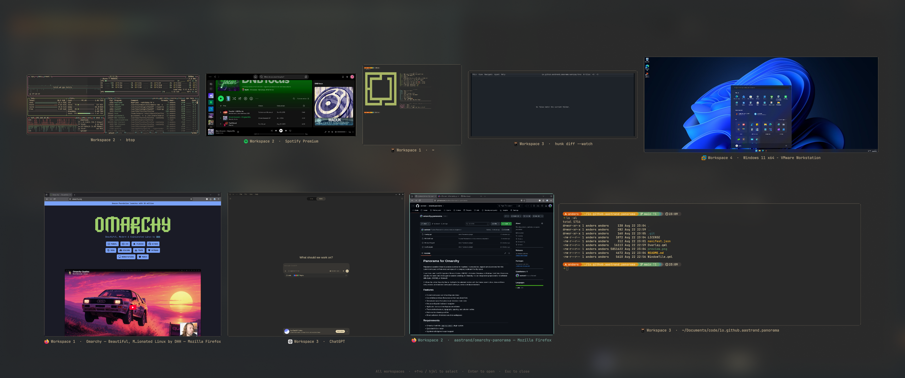

# Panorama for Omarchy



Panorama is a native Omarchy window overview for Hyprland. It presents live,
aspect-correct previews from the current workspace or from every workspace in a
compact, keyboard-friendly layout.

If you have used macOS Exposé or Mission Control, GNOME's Activities Overview,
or Windows Task View, Panorama provides the same kind of at-a-glance window
switching for Omarchy. It is an independent project and is not affiliated with
Apple, GNOME, or Microsoft.

It follows the active Omarchy theme, highlights the selected window with the
theme accent colour, dims every monitor while it is open, and switches
workspaces when you select a window elsewhere.

## Features

- Current-workspace and all-workspaces views
- Live window previews that preserve their real proportions
- Size-aware layout that gives larger windows more room
- Mouse and spatial keyboard navigation
- Application icons and workspace-aware labels
- Theme-derived colours, typography, spacing, and selection outline
- Dimming across every monitor, with optional background blur
- Direct activation of windows on other workspaces

## Requirements

- Omarchy 4 with the `omarchy-shell` plugin system
- Quickshell 0.3 or newer
- Hyprland with toplevel-export support

Current Omarchy installations provide these components. Panorama has no other
dependencies: it ships two QML files, bundles no third-party code, installs no
binaries, and makes no network requests.

## Installation

Install and enable Panorama with Omarchy's plugin manager:

```bash
omarchy plugin add https://github.com/aastrand/omarchy-panorama.git --enable
```

Omarchy displays its unsandboxed-plugin warning, clones the repository,
validates the manifest, and enables the overlay. Panorama does not modify your
Hyprland configuration or any other file on your system; the keybindings and
blur rule below are optional steps you apply yourself.

## Keybindings

Add the following to `~/.config/hypr/bindings.lua`:

```lua
o.bind("CTRL + UP", "Panorama all workspaces", "omarchy-shell shell toggle io.github.aastrand.panorama all")
o.bind("CTRL + DOWN", "Panorama current workspace", "omarchy-shell shell toggle io.github.aastrand.panorama current")
```

- `Ctrl+Up` shows windows from every workspace.
- `Ctrl+Down` shows windows from the current workspace.

You can also open either view directly:

```bash
omarchy-shell shell summon io.github.aastrand.panorama all
omarchy-shell shell summon io.github.aastrand.panorama current
```

`toggle` closes Panorama if it is already open; `summon` always opens it. The
final argument is the scope, and anything other than `all` is treated as the
current workspace.

## Background blur

Add this layer rule to `~/.config/hypr/hyprland.lua`. Panorama dims every
monitor on its own; this rule is what adds blur behind the dimming, and the
active Omarchy theme continues to control the blur strength:

```lua
hl.layer_rule({
  name = "panorama-background-blur",
  match = { namespace = "^io[.]github[.]aastrand[.]panorama([.]backdrop)?$" },
  blur = true,
  ignore_alpha = 0.1,
})
```

Reload Hyprland after changing the configuration:

```bash
hyprctl reload
hyprctl configerrors
```

## Controls

- Click a preview to activate that window.
- Hover a preview to move the selection to it.
- Use the arrow keys or `h`, `j`, `k`, and `l` to move the selection.
- Press `Enter` to activate the selected window.
- Press `Esc` or click the background to close Panorama.

## How it works

Panorama runs inside the existing `omarchy-shell` process. It uses Quickshell's
Hyprland model to enumerate windows and `ScreencopyView` to request live
per-window previews through Hyprland's toplevel-export protocol.

Capture is best-effort. If a client does not provide a capture handle, Panorama
keeps the window selectable using its application ID and title. It does not
write screenshots or preview caches to disk, and it reads no data beyond what
the compositor already reports about your own windows.

Thumbnails are drawn on the focused monitor only. Other monitors receive a
dimming layer so the overview reads as a desktop-wide mode.

## Source overview

| File | Purpose |
| --- | --- |
| `manifest.json` | Plugin metadata and the `overlay` entry point |
| `Overlay.qml` | Entry point: shell contract, window model, layout, keyboard handling, panel surfaces |
| `WindowTile.qml` | One thumbnail: live capture, fallback text, icon and title label, hit testing |
| `preview.png` | Screenshot used in this README |

Both QML files carry inline documentation covering the `omarchy-shell` plugin
contract, the layout algorithm, and the theme tokens they read.

## Development

Validate the manifest after making changes:

```bash
omarchy plugin validate .
```

An installed plugin normally reloads automatically. To force rediscovery, run:

```bash
omarchy-shell shell rescanPlugins
```

Panorama logs a line to the shell journal each time it opens, which is the
quickest way to confirm the scope and window count it received.

## Removal

Remove the plugin through Omarchy:

```bash
omarchy plugin remove io.github.aastrand.panorama
```

If you added the optional integration, also remove the two Panorama entries
from `~/.config/hypr/bindings.lua` and the `panorama-background-blur` layer rule
from `~/.config/hypr/hyprland.lua`. Then reload Hyprland:

```bash
hyprctl reload
hyprctl configerrors
```

Panorama leaves nothing else behind: no state files, caches, or configuration
of its own.

## References

- [Omarchy shell plugins](https://github.com/basecamp/omarchy/blob/quattro/docs/omarchy-shell.md)
- [Quickshell HyprlandToplevel](https://master.quickshell.org/docs/types/Quickshell.Hyprland/HyprlandToplevel/)
- [Quickshell HyprlandWorkspace](https://master.quickshell.org/docs/types/Quickshell.Hyprland/HyprlandWorkspace/)
- [Quickshell ScreencopyView](https://master.quickshell.org/docs/types/Quickshell.Wayland/ScreencopyView/)

## License

Panorama is available under the [MIT License](LICENSE). `preview.png` is an
original screenshot of Panorama and is covered by the same licence.

Exposé and Mission Control are trademarks of Apple Inc. Windows is a trademark
of Microsoft Corporation. Other names may be trademarks of their respective
owners.
